# Purpose

This is my Data Science 871 project , this README shows the method I
used in each question. Enjoy!

# Clean the environment

``` r
rm(list = ls()) # Clean your environment:
gc() # garbage collection - It can be useful to call gc after a large object has been removed, as this may prompt R to return memory to the operating system.
```

    ##           used (Mb) gc trigger (Mb) limit (Mb) max used (Mb)
    ## Ncells  550211 29.4    1221908 65.3         NA   700245 37.4
    ## Vcells 1055373  8.1    8388608 64.0      16384  1963382 15.0

``` r
library(pacman)
p_load(tidyverse, lubridate)
```

## Question 1

## Looking at the Persistence of Baby Names in the US

``` r
gc() # garbage collection - It can be useful to call gc after a large object has been removed, as this may prompt R to return memory to the operating system.
```

    ##           used (Mb) gc trigger  (Mb) limit (Mb) max used (Mb)
    ## Ncells  942193 50.4    1905964 101.8         NA  1221908 65.3
    ## Vcells 1647259 12.6    8388608  64.0      16384  2173125 16.6

``` r
library(pacman)
p_load(tidyverse, lubridate)
library(tidytext)
library(dplyr)
library(xtable)

list.files('Question1/code/', full.names = T, recursive = T) %>% as.list() %>% walk(~source(.))

# Here I imported the data in a way that allows a user with the same path way to do the same 
Top_100_Billboard <- read_rds(here::here("Question1","data", "US_Baby_names", "charts.rds"))
Baby_Names <- read_rds(here::here("Question1","data", "US_Baby_names", "Baby_Names_By_US_State.rds"))
HBO_titles <-read_rds(here::here("Question1","data", "US_Baby_names","HBO_titles.rds"))
HBO_credits <- read_rds(here::here("Question1","data", "US_Baby_names","HBO_credits.rds"))


# I sourced the code in a way that allows a user with the same path to do the same 
code_files <- list.files(here::here("Question1","code"), pattern = "\\.R$", full.names = TRUE)
invisible(lapply(code_files, source))


# Join HBO data and Song Name to Baby Names data according to matching Names , the Song names portion was dropped 
HBO_Bill_Names(data1= Baby_Names, data2 = Top_100_Billboard, data3 = HBO_credits)
```

    ## # A tibble: 3,973,541 × 7
    ##       Id name      Year Gender State Count source
    ##    <dbl> <chr>    <dbl> <chr>  <chr> <dbl> <chr> 
    ##  1     1 Mary      1910 F      AK       14 HBO   
    ##  2     2 Annie     1910 F      AK       12 HBO   
    ##  3     3 Anna      1910 F      AK       10 HBO   
    ##  4     4 Margaret  1910 F      AK        8 HBO   
    ##  5     5 Helen     1910 F      AK        7 HBO   
    ##  6     6 Elsie     1910 F      AK        6 HBO   
    ##  7     7 Lucy      1910 F      AK        6 HBO   
    ##  8     8 Dorothy   1910 F      AK        5 HBO   
    ##  9     9 Mary      1911 F      AK       12 HBO   
    ## 10    10 Margaret  1911 F      AK        7 HBO   
    ## # ℹ 3,973,531 more rows

``` r
# A bar graph showing the most popular names 
most_common_hbo_names(data1=Baby_Names, data2 = Top_100_Billboard , data3= HBO_credits)
```

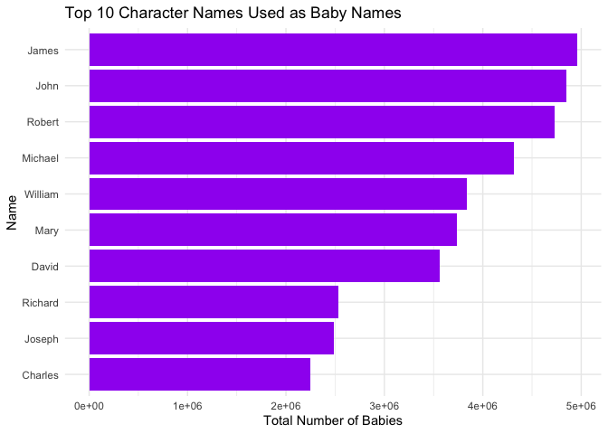

``` r
# A line graph showing the trend in popular. names
trend(data1 = Baby_Names , data2 = Top_100_Billboard , data3 = HBO_credits)
```

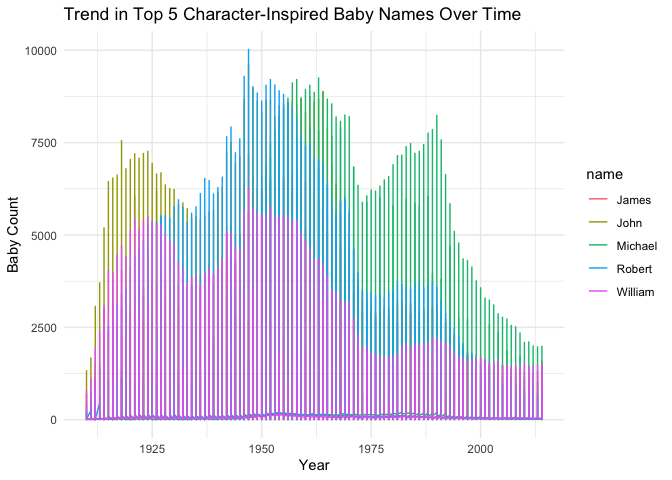

``` r
# A Spear Correlation showing the persistence of names 
spear1(data = Baby_Names)
```

    ## Warning: Removed 6 rows containing missing values or values outside the scale range
    ## (`geom_line()`).

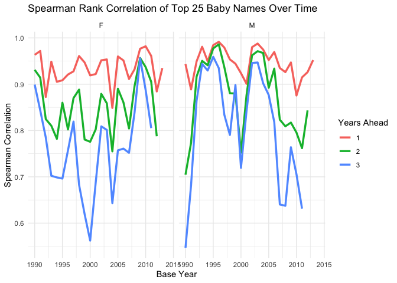

``` r
# A table showing the persistence in the year 1974
 print(
      xtable(
    get_spearman_for_year(data = Baby_Names, y = 1974, g = "F") %>%
      dplyr::mutate(
        Year = as.integer(Year),
        Future_Year = as.integer(Future_Year)
      ),
    caption = "Persistence of Female Names \\label{tab1}"
  ),
  include.rownames = FALSE,
  caption.placement = "bottom",
  comment = FALSE
)
```

    ## \begin{table}[ht]
    ## \centering
    ## \begin{tabular}{rlrrr}
    ##   \hline
    ## Year & Gender & Offset & Future\_Year & Spearman \\ 
    ##   \hline
    ## 1974 & F &   1 & 1975 & 0.94 \\ 
    ##   1974 & F &   2 & 1976 & 0.83 \\ 
    ##   1974 & F &   3 & 1977 & 0.63 \\ 
    ##    \hline
    ## \end{tabular}
    ## \caption{Persistence of Female Names \label{tab1}} 
    ## \end{table}

## Question 2

## ColdPlay vs Metallica

``` r
if(!require("tidyverse")) install.packages("tidyverse")
library(tidyverse)

# Here I imported the data in a way that allows a user with the same path way to do the same 
coldplay  <- read_csv(here::here("Question2","data", "Coldplay_vs_Metallica", "Coldplay.csv")) %>%  rename(album = `album_name`)
```

    ## Rows: 232 Columns: 15
    ## ── Column specification ────────────────────────────────────────────────────────
    ## Delimiter: ","
    ## chr   (2): name, album_name
    ## dbl  (11): duration, popularity, acousticness, danceability, energy, instrum...
    ## lgl   (1): explicit
    ## date  (1): release_date
    ## 
    ## ℹ Use `spec()` to retrieve the full column specification for this data.
    ## ℹ Specify the column types or set `show_col_types = FALSE` to quiet this message.

``` r
metallica <- read_csv(here::here("Question2","data", "Coldplay_vs_Metallica", "metallica.csv"))
```

    ## Rows: 1468 Columns: 14
    ## ── Column specification ────────────────────────────────────────────────────────
    ## Delimiter: ","
    ## chr   (2): name, album
    ## dbl  (11): duration_ms, popularity, danceability, energy, loudness, speechin...
    ## date  (1): release_date
    ## 
    ## ℹ Use `spec()` to retrieve the full column specification for this data.
    ## ℹ Specify the column types or set `show_col_types = FALSE` to quiet this message.

``` r
spotify <- read_rds(here::here("Question2","data", "Coldplay_vs_Metallica", "Broader_Spotify_Info.rds"))
billboard_100 <- read_rds(here::here("Question2","data", "Coldplay_vs_Metallica", "charts.rds"))

# I sourced the code in a way that allows a user with the same path to do the same 
code_files <- list.files(here::here("Question2","code"), pattern = "\\.R$", full.names = TRUE)
invisible(lapply(code_files, source))


# A box plot comparing Parachutes and 72 Seasons by track popularity 
plot_album_comparison(data1 = coldplay , data2 = metallica)
```

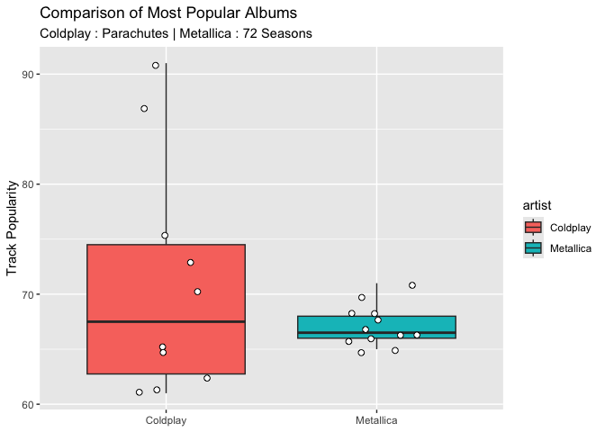

``` r
# A scatter plot showing how song length affects the popularity of songs 
duration(data1 = coldplay, data2= metallica)
```

    ## `geom_smooth()` using formula = 'y ~ x'

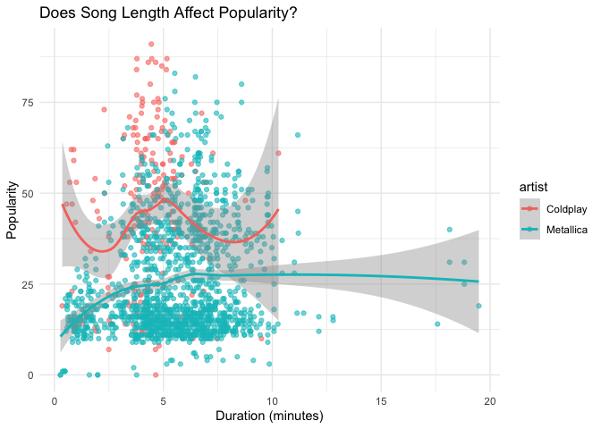

``` r
# A density plot comparing the distribution of danceability songs by each band 
dannce_plot(data=coldplay, data2 = metallica)
```

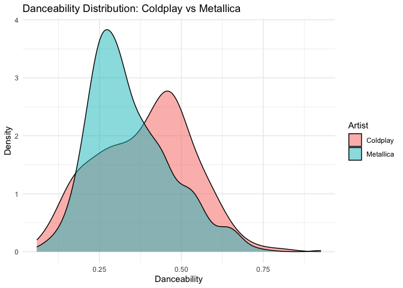

``` r
# A scatter plot showing the trend in average danceability of songs overtime 
danu(data = spotify)
```

    ## Warning: Using `size` aesthetic for lines was deprecated in ggplot2 3.4.0.
    ## ℹ Please use `linewidth` instead.
    ## This warning is displayed once every 8 hours.
    ## Call `lifecycle::last_lifecycle_warnings()` to see where this warning was
    ## generated.

    ## `geom_smooth()` using formula = 'y ~ x'

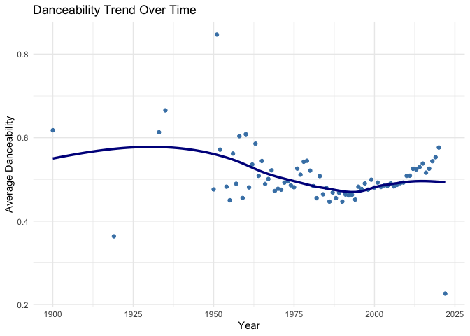

## Question 3

# Advising Netflix

``` r
if(!require("tidyverse")) install.packages("tidyverse")
library(tidyverse)
library(forcats)

# Here I imported the data in a way that allows a user with the same path way to do the same
Titles <- read_rds(here::here("Question3","data", "netflix", "titles.rds"))
Credit <- read_rds(here::here("Question3","data", "netflix", "credits.rds"))
Movie_Info <- read_csv(here::here("Question3","data", "netflix", "netflix_movies.csv"))
```

    ## Rows: 6131 Columns: 12
    ## ── Column specification ────────────────────────────────────────────────────────
    ## Delimiter: ","
    ## chr (11): show_id, type, title, director, cast, country, date_added, rating,...
    ## dbl  (1): release_year
    ## 
    ## ℹ Use `spec()` to retrieve the full column specification for this data.
    ## ℹ Specify the column types or set `show_col_types = FALSE` to quiet this message.

``` r
# I sourced the code in a way that allows a user with the same path to do the same 
code_files <- list.files(here::here("Question3","code"), pattern = "\\.R$", full.names = TRUE)
invisible(lapply(code_files, source))

# A barplot showing the top rated genres by production country 
uno(data= Titles , top_n_genres =5, top_n_countries =5)
```

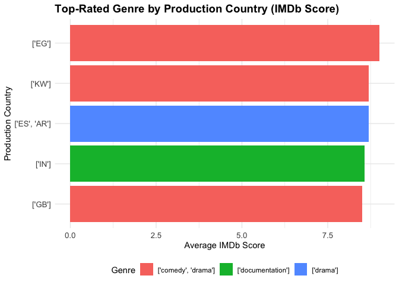

``` r
# A line graph showing the trend of the popularity of movies by release years
trend(data = Titles)
```

    ## `geom_smooth()` using formula = 'y ~ x'

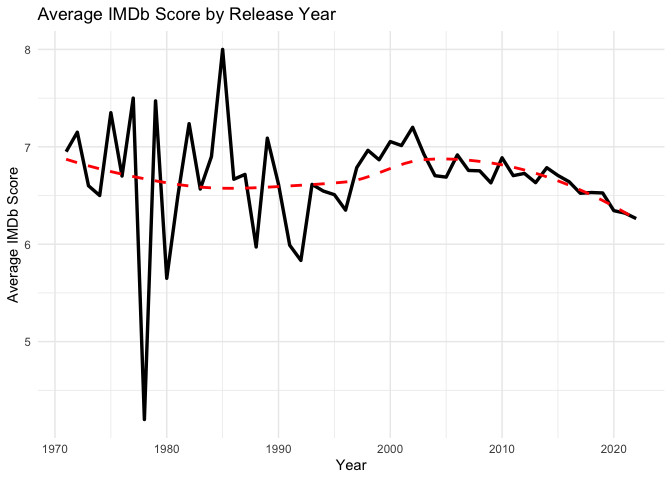

``` r
# A bar graph showing the directors who directed the most shows or movies 
top_director(data1 = Titles , data2 = Movie_Info)
```

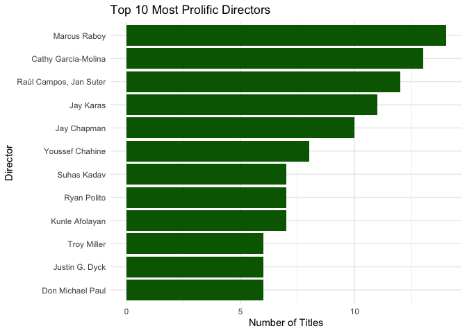

``` r
# A density plot showing the IMDb distribution by the top 5 most prolific directors 
top_producer_facet(data1= Titles , data2 = Movie_Info)
```

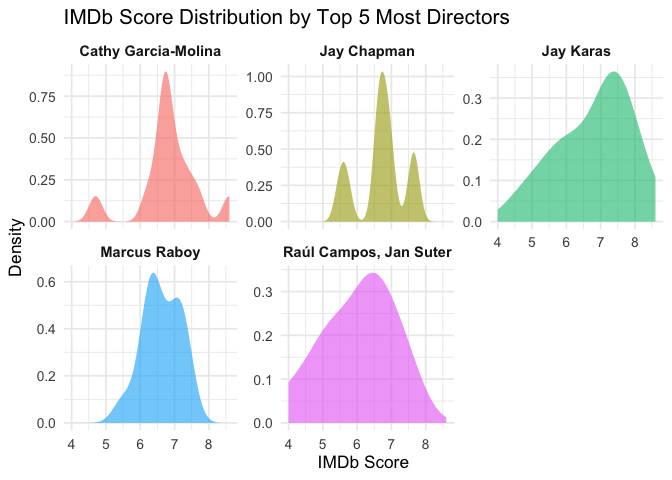

## Question 4

## Billionaire : Self- Made or Daddy Made

``` r
if(!require("tidyverse")) install.packages("tidyverse")
library(tidyverse)
library(dplyr)
library(xtable)

# Here I imported the data in a way that allows a user with the same path way to do the same
Billions <- read_csv(here::here("Question4","data", "Billions","billionaires.csv")) %>% arrange(desc(company.founded)) 
```

    ## Rows: 2614 Columns: 19
    ## ── Column specification ────────────────────────────────────────────────────────
    ## Delimiter: ","
    ## chr (13): name, company.name, company.relationship, company.sector, company....
    ## dbl  (6): rank, year, company.founded, demographics.age, location.gdp, wealt...
    ## 
    ## ℹ Use `spec()` to retrieve the full column specification for this data.
    ## ℹ Specify the column types or set `show_col_types = FALSE` to quiet this message.

``` r
# I sourced the code in a way that allows a user with the same path to do the same
code_files <- list.files(here::here("Question4", "code"), pattern = "\\.R$", full.names = TRUE)
invisible(lapply(code_files, source))

# A barplot showing the number of Billionaires in USA and Rest of the World by their inheritance status 
firstplot(data = Billions , Title = "Billionaires : Inherited Wealth ( USA vs Rest of World") 
```

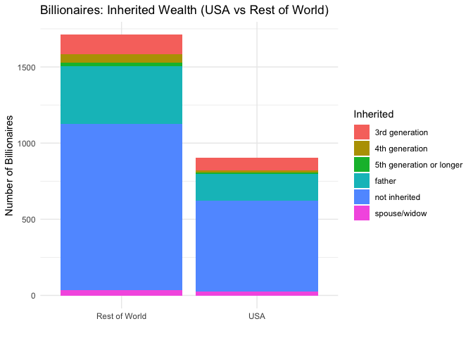

``` r
# A barplot showing the top sectors producing billionaires post the dot.com period 
third_plot(data = Billions , Title = "Top 10 Sectors Producing the Most Self- Made Billionaires Since 2000")
```

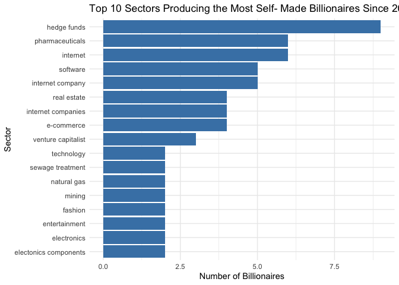

``` r
# A table showing the percentages of USA billionaires by their inheritance status 
print(
  xtable(us_inheritance_table(data = Billions) , caption = "USA Billionaires by Inheritance Status \\label{tab1}"),
  include.rownames = FALSE,
  caption.placement = "bottom" , comment = FALSE ,
)
```

    ## \begin{table}[ht]
    ## \centering
    ## \begin{tabular}{lrr}
    ##   \hline
    ## wealth.how.inherited & count & percentage \\ 
    ##   \hline
    ## not inherited & 597 & 66.10 \\ 
    ##   father & 177 & 19.60 \\ 
    ##   3rd generation &  84 & 9.30 \\ 
    ##   spouse/widow &  24 & 2.70 \\ 
    ##   4th generation &  11 & 1.20 \\ 
    ##   5th generation or longer &  10 & 1.10 \\ 
    ##    \hline
    ## \end{tabular}
    ## \caption{USA Billionaires by Inheritance Status \label{tab1}} 
    ## \end{table}

``` r
# A table showing the percentages of Rest of World  billionaires by their inheritance status
print(
  xtable(non_us_inheritance_table(data = Billions), caption = "Rest of the World by Inheritance Status\\label{tab2}"),
  include.rownames = FALSE,
  caption.placement = "bottom" , comment = FALSE 
)
```

    ## \begin{table}[ht]
    ## \centering
    ## \begin{tabular}{lrr}
    ##   \hline
    ## wealth.how.inherited & count & percentage \\ 
    ##   \hline
    ## not inherited & 1091 & 63.80 \\ 
    ##   father & 381 & 22.30 \\ 
    ##   3rd generation & 126 & 7.40 \\ 
    ##   4th generation &  57 & 3.30 \\ 
    ##   spouse/widow &  35 & 2.00 \\ 
    ##   5th generation or longer &  21 & 1.20 \\ 
    ##    \hline
    ## \end{tabular}
    ## \caption{Rest of the World by Inheritance Status\label{tab2}} 
    ## \end{table}

``` r
# A table showing which companies have the most billionaires associated with them 
print(
  xtable(top5_companies_table(data = Billions) , caption = "Companies With Most Billionaires \\label{tab3}"),
  include.rownames = FALSE,
  caption.placement = "bottom" , comment = FALSE ,
)
```

    ## \begin{table}[ht]
    ## \centering
    ## \begin{tabular}{lrl}
    ##   \hline
    ## company.name & total\_billionaires & region \\ 
    ##   \hline
    ## Walmart &  18 & USA \\ 
    ##   Campbell Soup &  16 & USA \\ 
    ##   Hyatt &  15 & USA \\ 
    ##   SAP AG &  12 & Rest of World \\ 
    ##   Microsoft &  11 & USA \\ 
    ##    \hline
    ## \end{tabular}
    ## \caption{Companies With Most Billionaires \label{tab3}} 
    ## \end{table}

## Question 5

## Health Dynamics

``` r
if(!require("tidyverse")) install.packages("tidyverse")
library(tidyverse)
library(dplyr)


# Here I imported the data in a way that allows a user with the same path way to do the same
Health <- read_csv(here::here("Question5","data", "Health","HealthCare.csv")) 
```

    ## Rows: 100 Columns: 13
    ## ── Column specification ────────────────────────────────────────────────────────
    ## Delimiter: ","
    ## chr  (3): Gender, Physical Activity Level, Sleep Quality
    ## dbl (10): Participant ID, Age, Current Weight (lbs), BMR (Calories), Daily C...
    ## 
    ## ℹ Use `spec()` to retrieve the full column specification for this data.
    ## ℹ Specify the column types or set `show_col_types = FALSE` to quiet this message.

``` r
# I sourced the code in a way that allows a user with the same path to do the same
code_files <- list.files(here::here("Question5", "code"), pattern = "\\.R$", full.names = TRUE)
invisible(lapply(code_files, source))

# Here I created a box plot to see the relationship between physical activity and weight change 
box_plot(data = Health)
```

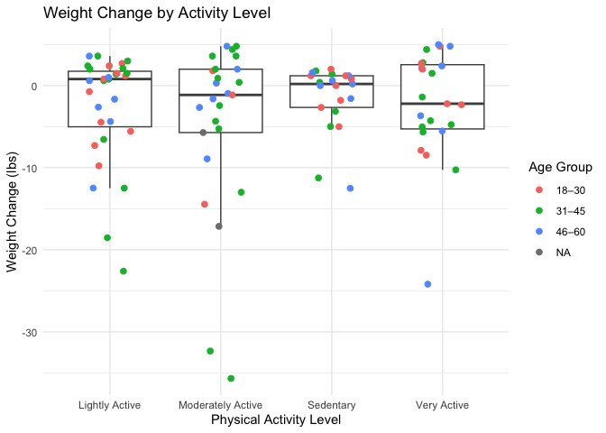

``` r
# A regression model with Weigh change as the dependent variable 
first_model(data = Health)
```

    ## 
    ## Call:
    ## lm(formula = `Weight Change (lbs)` ~ Age + `Physical Activity Level` + 
    ##     `Stress Level` + `Sleep Quality`, data = data)
    ## 
    ## Residuals:
    ##      Min       1Q   Median       3Q      Max 
    ## -21.7945  -2.2520   0.5529   3.2185  10.1771 
    ## 
    ## Coefficients:
    ##                                             Estimate Std. Error t value
    ## (Intercept)                                 6.509046   2.551901   2.551
    ## Age                                        -0.007842   0.043886  -0.179
    ## `Physical Activity Level`Moderately Active -0.652154   1.430916  -0.456
    ## `Physical Activity Level`Sedentary         -0.217573   1.471138  -0.148
    ## `Physical Activity Level`Very Active        1.644288   1.452453   1.132
    ## `Stress Level`                             -1.162708   0.208710  -5.571
    ## `Sleep Quality`Fair                        -0.326267   1.704699  -0.191
    ## `Sleep Quality`Good                        -0.383493   1.741405  -0.220
    ## `Sleep Quality`Poor                        -8.962443   1.600158  -5.601
    ##                                            Pr(>|t|)    
    ## (Intercept)                                  0.0124 *  
    ## Age                                          0.8586    
    ## `Physical Activity Level`Moderately Active   0.6496    
    ## `Physical Activity Level`Sedentary           0.8828    
    ## `Physical Activity Level`Very Active         0.2606    
    ## `Stress Level`                             2.55e-07 ***
    ## `Sleep Quality`Fair                          0.8486    
    ## `Sleep Quality`Good                          0.8262    
    ## `Sleep Quality`Poor                        2.24e-07 ***
    ## ---
    ## Signif. codes:  0 '***' 0.001 '**' 0.01 '*' 0.05 '.' 0.1 ' ' 1
    ## 
    ## Residual standard error: 5.178 on 91 degrees of freedom
    ## Multiple R-squared:  0.5552, Adjusted R-squared:  0.5161 
    ## F-statistic:  14.2 on 8 and 91 DF,  p-value: 3.15e-13

``` r
# A pie chart showing the distribution of sleep 
sleep_chart(data = Health)
```

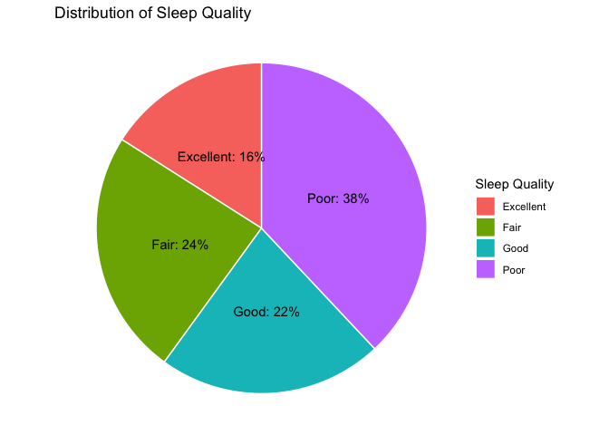
